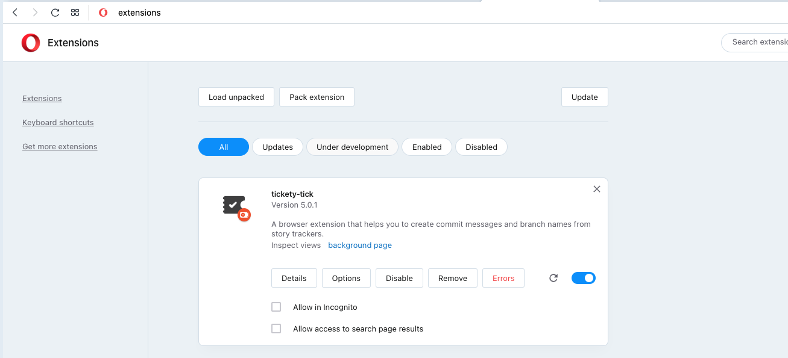

# Opera

[Opera](https://www.opera.com) is no longer accepting extensions for their own [add-ons](https://addons.opera.com/en/extensions/) platform. Users can directly instead install add-ons via the [Chrome Web Store](https://chrome.google.com/webstore).

## Install Tickety-Tick

1. Open Opera
    
2. Add the `TicketyTick` add-on via the [Chrome Web Store](https://chrome.google.com/webstore/detail/tickety-tick/ciakolhgmfijpjbpcofoalfjiladihbg). Opera will warn you that the extension is not from the Opera addons store, but click on "Add extension".
    
3. Celebrate 🎉
    
