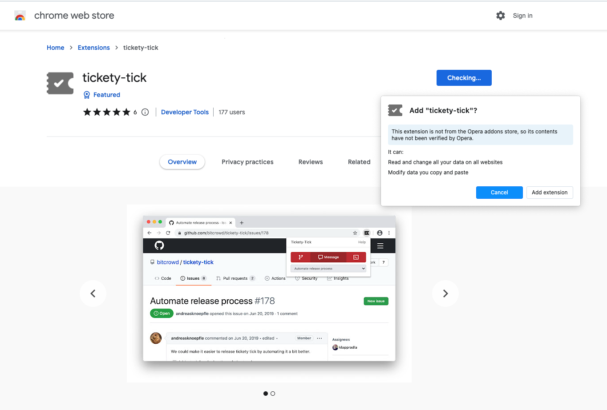

# Opera

[Opera](https://www.opera.com) is no longer accepting extensions for their own [add-ons](https://addons.opera.com/en/extensions/) platform. Users can instead install add-ons via the [Chrome Web Store](https://chrome.google.com/webstore), with the [Install Chrome Extensions](https://addons.opera.com/en-gb/extensions/details/install-chrome-extensions/) add on by the Opera team bridging the gap.

## Install TicketyTick

1. Open Opera
    
1. Install the [Install Chrome Extensions](https://addons.opera.com/en-gb/extensions/details/install-chrome-extensions/) add-on
    
1. Add the `TicketyTick` add-on via the [Chrome Web Store](https://chrome.google.com/webstore/detail/tickety-tick/ciakolhgmfijpjbpcofoalfjiladihbg)
    
1. Install the add-on
    
1. Celebrate 🎉
    
