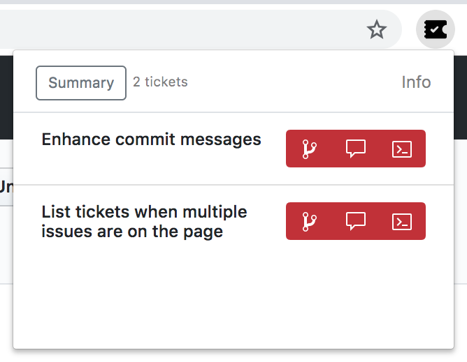
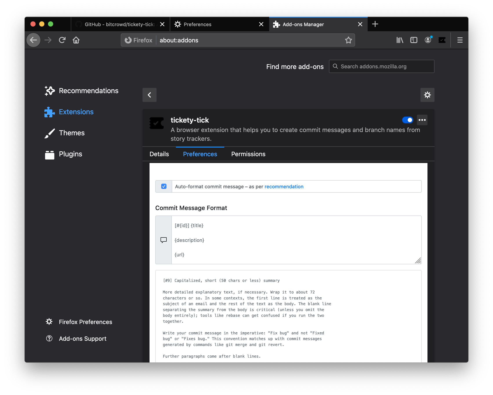
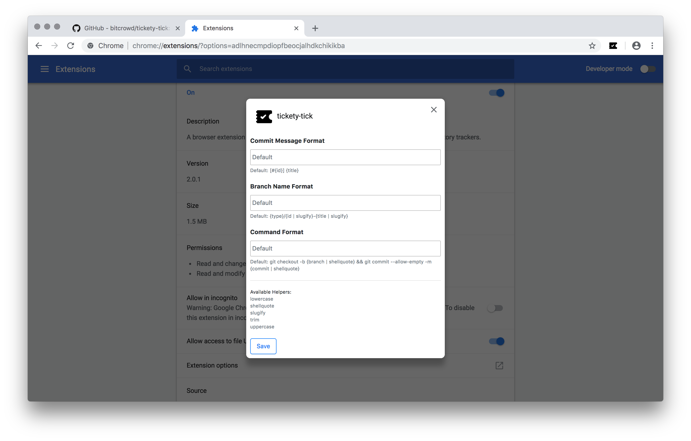
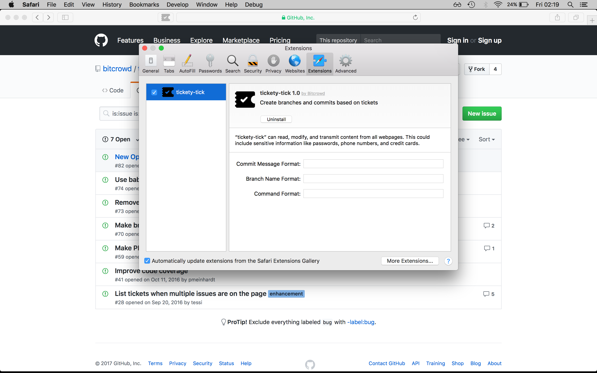

# Tickety-Tick [](https://travis-ci.org/bitcrowd/tickety-tick)

> #### How do you name this branch? What is the message for that commit?
> A browser extension to generate these for you,
> based on the ticket you're working on.



At bitcrowd we love conventions. One of them is how we name branches and
commits. This makes it easy to relate a particular branch or commit to a
certain ticket.

**Branches** follow the format `type/id-title` by default, where:

- `type` is usually one of:
  - `feature` (default)
  - `bug`
  - `chore`
  - …
- `id` is the identifier of the ticket in your ticketing system
- `title` is a lowercase, dasherized version of the ticket title

**Commits** contain `[#id] title` by default.

Additionally, Tickety-Tick generates [**commands**](#generated-commands) to
set up a branch with the proper name and to prepare the commit message for your
source code management tool. Out of the box, it is set up to work with Git.

If you need your commit messages, branch names or commands to look different,
you can [configure](#advanced-configuration) Tickety-Tick to use a custom
format.

## Supported ticket systems

Tickety-Tick helps you create branches and commits for a few ticket systems.

Currently, we support:

- GitHub
- GitLab
- Jira
- Pivotal Tracker
- Trello

## Installation

Tickety-Tick is available for every major browser:

- [Chrome/Chromium](https://chrome.google.com/webstore/detail/ciakolhgmfijpjbpcofoalfjiladihbg)
- [Firefox](https://addons.mozilla.org/firefox/addon/tickety-tick/)
- [Opera](https://addons.opera.com/extensions/details/tickety-tick/)
- For Safari, you need to build it yourself ([see below](#safari))

## Keyboard Shortcuts

| Shortcut | Description                       |
|----------|-----------------------------------|
| Ctrl + T | Open the extension's popup dialog |

## Building

In order to build the extension from source, run:

```shell
yarn install
yarn checks
yarn build
```

To only build for a specific browser, use:

```shell
yarn build:chrome
yarn build:firefox
yarn build:safari
```

## Installing a custom-built version

### Chrome

Navigate to the [chrome://extensions](chrome://extensions) page, enable
"Developer mode" and press "Load unpacked extension". Point it to the
`dist/chrome` directory. Done.

### Firefox

If you just want to try out and debug the extension, go to
[about:debugging#addons](about:debugging#addons). Then press "Load Temporary
Add-On" and select the `manifest.json` from the built extension directory.

If you want to install this addon permanently, build with
`yarn build:firefox-local`, then go to [about:addons](about:addons) and click
on the small cog icon. Select `Install Add-on From File...` and choose
`dist/firefox-local`.

### Opera

Same process as in [Chrome](#chrome).

### Safari

Open Safari and enable the "Developer Menu" in the application preferences. Now
go to the developer menu and open the "Extension Builder". Press the "+" button
and add the `dist/tickety-tick.safariextension` that you just built.

## Development

### Building releases

Chrome Web Store and Firefox Addons require you to submit extensions as a
single zip archive. To build and zip the extension for a release, run:

```shell
yarn bundle:chrome
yarn bundle:firefox
```

### Developing Tickety-Tick

For development use `yarn watch:[browser]`. This will watch the files and
rebuild the extension whenever source files change.

To test-drive a development version, you can use:

```shell
yarn open:chrome
yarn open:firefox-local
```

You can run both `watch:[browser]` and `open:[browser]` scripts in parallel to
automatically rebuild and reload the extension as you make changes.

### Running automated checks

To execute the automated source code checks, run:

```shell
yarn checks
```

### Generating coverage reports

In order to generate code coverage reports locally, just run:

```shell
yarn test:coverage
```

Then, to generate and view HTML reports:

```shell
yarn run nyc report --reporter lcov
open coverage/lcov-report/index.html
```

## Insights

### Generated commands

As mentioned earlier, in addition to branch names and commit messages,
Tickety-Tick generates commands to set up a branch with the proper name
and to prepare the commit message.

By default, the code generated for copying will look like this:

```shell
git checkout -b BRANCH-NAME && git commit --allow-empty -m COMMIT-MESSAGE
```

These default generated commands make a few assumptions:

1. *You're using git (obviously).* The branch names and commit messages
   Tickety-Tick generates may work with other version control systems,
   but the commands generated for copying specifically include git.
2. *You squash commits from feature branches (or you're okay with empty commits).*
   When you work with feature branches and you squash them before merging, git
   (and GitHub) allow you to combine the messages of the feature-branch
   commits. The empty commit provides a simple mechanism for storing the commit
   message title generated by Tickety-Tick when setting up the branch.

This approach works nicely with our git workflow, for which the above
assumptions are true. Yours may be different though, in which case you might
want to [configure](#advanced-configuration) Tickety-Tick differently.

### Advanced configuration

If you have different conventions regarding commit messages, branch names or
you're just using a different source code management tool, Tickety-Tick allows
you to customize the output format for all of these.

In Firefox, open `about:addons` and select the Tickety-Tick preferences.



In Chrome, open `chrome://extensions/` and select "Options".



In Safari, open "Preferences" (`cmd + ,`), then select "Extensions".


