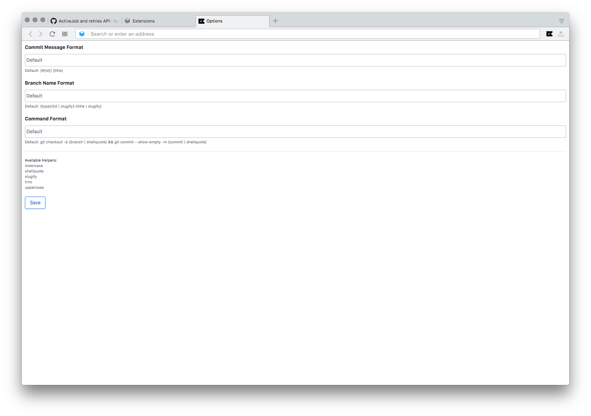

# Tickety-Tick [](https://circleci.com/gh/bitcrowd/tickety-tick)

> #### How do you name this branch? What is the message for that commit?
> A browser extension to generate these for you, based on the ticket you're working on.


At bitcrowd we love conventions. One of them is how we name branches and commits. This makes it easy to relate a particular branch or commit to a certain ticket.

**Branches** follow the format `type/id-title` by default, where:

- `type` is usually one of:
  - `feature` (default)
  - `bug`
  - `chore`
  - …
- `id` is the identifier of the ticket in your ticketing system
- `title` is a lowercase, dasherized version of the ticket title

**Commits** contain `[#id] title` by default.

Additionally, Tickety-Tick generates [**commands**](#generated-commands) to set up a branch with the proper name and to prepare the commit message for your source code management tool. Out of the box, it is set up to work with Git.

If you need your commit messages, branch names or commands to look different, you can [configure](#advanced-configuration) Tickety-Tick to use a custom format.

## Supported ticket systems

Tickety-Tick helps you create branches and commits for a few ticket systems.

Currently, we support:

- [GitHub](https://github.com/)
- [GitLab](https://gitlab.com/)
- [Jira](https://www.atlassian.com/software/jira)
- [Ora](https://ora.pm/)
- [Pivotal Tracker](https://www.pivotaltracker.com/)
- [Trello](https://trello.com/)

## Installation

Tickety-Tick is available for every major browser:

- [Chrome/Chromium](https://chrome.google.com/webstore/detail/ciakolhgmfijpjbpcofoalfjiladihbg)
- [Firefox](https://addons.mozilla.org/firefox/addon/tickety-tick/)
- [Opera](./OPERA.md)
- For Safari, you need to build it yourself ([see below](#safari))

## Keyboard Shortcuts

| Shortcut | Description                       |
|----------|-----------------------------------|
| Ctrl + T | Open the extension's popup dialog |

## Building

In order to build the extension from source, run:

```shell
yarn install
yarn checks
yarn build
```

To only build for a specific browser, use:

```shell
yarn build:chrome
yarn build:firefox
yarn build:safari
```

## Installing a custom-built version

### Chrome

Navigate to the [chrome://extensions](//chrome://extensions) page, enable "Developer mode" and press "Load unpacked extension". Point it to the `dist/chrome` directory. Done.

### Firefox

If you just want to try out and debug the extension, go to [about:debugging#addons](//about:debugging#addons). Then press "Load Temporary Add-On" and select the built `manifest.json` from the `dist/firefox` extension directory.

If you want to install this addon permanently, go to [about:addons](//about:addons) and click on the small cog icon. Select `Install Add-on From File...` and choose `dist/firefox`.

### Opera

Navigate to the [opera://extensions](//opera://extensions) page, enable "Developer mode" and press "Load unpacked extension". Point it to the `dist/chrome` directory. Done.

### Safari

Open Safari and enable the "Developer Menu" in the application preferences. Now go to the developer menu and open the "Extension Builder". Press the "+" button and add the `dist/tickety-tick.safariextension` that you just built.

## Development

### Developing Tickety-Tick

For development use `yarn watch:[browser]`. This will watch the files and rebuild the extension whenever source files change.

To test-drive a development version, you can use:

```shell
yarn open:chrome
yarn open:firefox
```

You can run both `watch:[browser]` and `open:[browser]` scripts in parallel to automatically rebuild and reload the extension as you make changes.

### Running automated checks

To execute the automated source code checks, run:

```shell
yarn checks
```

Or, to run checks individually:

```shell
yarn lint
yarn test
```

Hint: You can append `--watch` and other options supported by [Jest](https://jestjs.io/docs/en/cli) to the test command, e.g.:

```shell
yarn test --watch
```

### Generating coverage reports

In order to generate code coverage reports locally, just run:

```shell
yarn test --coverage
```

To view an HTML version of the report:

```shell
open coverage/lcov-report/index.html
```

### Building releases

Chrome Web Store and Firefox Add-ons require you to submit extensions as a single zip archive. To build and zip the extension for a release, run:

```shell
yarn bundle:chrome
yarn bundle:firefox
```
You can also build a zip file for the safari extension to prepare for a release download on github with:

```shell
yarn bundle:safari
```

Or just run the following when you want to bundle everything:
```
yarn bundle
```

### Clean build folder

To clean the output build path and delete the artifacts of the project use:

```shell
yarn clean
```

### Releasing a new version

1. Tick the version with [`yarn version`](https://yarnpkg.com/en/docs/cli/version) (creates a Git tag)
2. Push the tag with `git push --tags`
3. Do a `yarn clean`
4. Build all bundles with `yarn bundle`
5. Draft a [new release on GitHub](https://github.com/bitcrowd/tickety-tick/releases/new)
6. Add package bundles to your new release
7. Publish release in Chrome and Mozilla stores

## Insights

### Generated commands

As mentioned earlier, in addition to branch names and commit messages, Tickety-Tick generates commands to set up a branch with the proper name and to prepare the commit message.

By default, the code generated for copying will look like this:

```shell
git checkout -b BRANCH-NAME && git commit --allow-empty -m COMMIT-MESSAGE
```

These default generated commands make a few assumptions:

1. *You're using Git (obviously).*

    The branch names and commit messages Tickety-Tick generates may work with other version control systems, but the commands generated for copying specifically include Git.

1. *You squash commits from feature branches (or you're okay with empty commits).*

    When you work with feature branches and you squash them before merging, Git (and GitHub) allow you to combine the messages of the feature-branch commits. The empty commit provides a simple mechanism for storing the commit message title generated by Tickety-Tick when setting up the branch.

This approach works nicely with our Git workflow, for which the above assumptions are true. Yours may be different though, in which case you might want to [configure](#advanced-configuration) Tickety-Tick differently.

### Advanced configuration

If you have different conventions regarding commit messages, branch names or you're just using a different source code management tool, Tickety-Tick allows you to customize the output format for all of these.

In Firefox, open [about:addons](//about:addons) and select the Tickety-Tick preferences and scroll to the bottom of the page.


In Chrome, open [chrome://extensions/](//chrome://extensions), click the "Details" button on the Tickety-Tick tile and select "Extension options".


In Opera, open [opera://extensions/](//opera://extensions), click the "Options" button on the Tickety-Tick tile.



In Safari, open "Preferences" (`cmd + ,`), then select "Extensions".


### Auto-formatting of commit messages

Tickety-Tick supports formatting generated commit messages according to [these recommendations](https://tbaggery.com/2008/04/19/a-note-about-git-commit-messages.html) by [Tim Pope](https://github.com/tpope/). If you do not want this, you can disable this feature in the extension preferences (see above).
