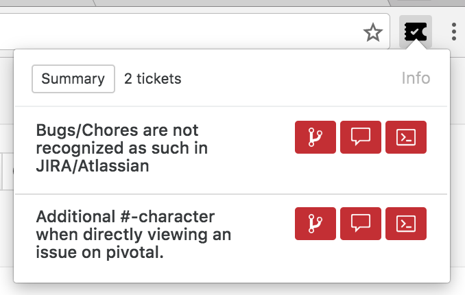

# Tickety-Tick [](https://travis-ci.org/bitcrowd/tickety-tick)

*How do you name this branch? What is the message for that commit?*

At bitcrowd we love conventions. One of them is how we name branches and
commits. This makes it easy to relate a particular branch or commit to a
certain ticket.



Branches always follow the format `type/id-title`, where `type` can be one of
`feature`, `bug`, `chore` etc., `id` is the identifier of the ticket in your
ticketing system and `title` is a lowercase, dasherized version of the ticket
title.

Commits always contain `[#id] title`.

Tickety-Tick helps you create branches and commits for a few ticket systems.

Currently, we support:

- Pivotal Tracker
- Jira
- Github
- Trello

## Installation

Tickety-Tick is available for every major browser:

- [Chrome/Chromium](https://chrome.google.com/webstore/detail/ciakolhgmfijpjbpcofoalfjiladihbg)
- [Firefox](https://addons.mozilla.org/de/firefox/addon/tickety-tick/)
- [Opera](https://addons.opera.com/en/extensions/details/tickety-tick/) (to be published)
- For Safari, you need to build it yourself (see below)

## Building

In order to build the extension from source, run:

```
npm install
npm run build
```

For development use `npm run watch`. This will watch the files and rebuild the
extension whenever source files change.

## Installing a custom-built version

### Chrome

Navigate to the [chrome://extensions](chrome://extensions) page, enable
"Developer mode" and press "Load unpacked extension". Point it to the
`dist/web-extension` directory. Done.

### Firefox

If you just want to try out and debug the extension, go to
[about:debugging#addons](about:debugging#addons). Then press "Load Temporary
Add-On" and select the `manifest.json` from the built extension directory.

### Opera

Same process as in [Chrome](#chrome).

### Safari

Open Safari and enable the "Developer Menu" in the application preferences. Now
go to the developer menu and open the "Extension Builder". Press the "+" button
and add the `dist/tickety-tick.safariextension` that you just built.
